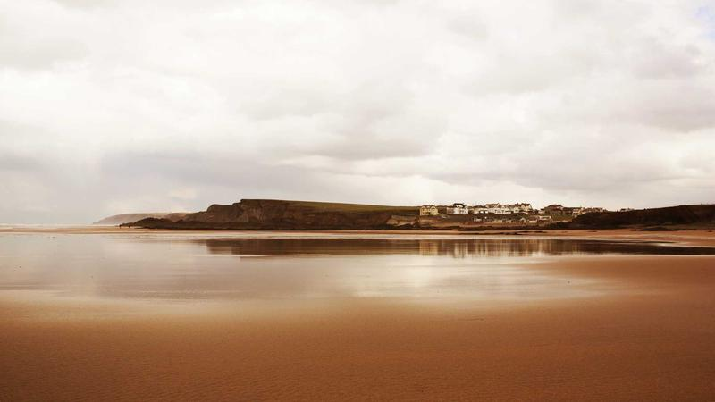

# Fazlur Rahman - Personal Portfolio



Source code for an interactive personal portfolio. This application serves as a comprehensive showcase of software engineering projects, professional experience, interests, and academic technical work.

The project emphasizes performance and clean architectural principles, utilizing a modern tech stack focused on responsiveness and smooth user experience.

## Technical Stack

*   **Core:** React 19, Vite
*   **Styling:** Tailwind CSS
*   **Animations:** Framer Motion
*   **Icons:** Lucide React
*   **Navigation:** React Router v7

## Key Features

*   **Project Gallery:** A dynamic, metadata-driven gallery featuring detailed project pages with architectural overviews.
*   **Global Travel Log:** An interactive, animated world map visualizing international travel history, linked to a chronological travelogue.
*   **Digital Library:** A categorized and filterable display of professional and leisure reading materials.
*   **Responsive Motion Design:** Mobile-first architecture with smooth transitions and physics-based spring animations.
*   **Automated Asset Management:** Custom scripts for fetching external resources such as book covers and metadata.

## Local Development

To run this portfolio locally:

1.  **Clone the repository:**
    ```bash
    git clone https://github.com/Montasir00/Portfolio-Website.git
    cd Portfolio-Website
    ```

2.  **Install dependencies:**
    ```bash
    npm install
    ```

3.  **Run development server:**
    ```bash
    npm run dev
    ```

4.  **Production build:**
    ```bash
    npm run build
    ```

## Directory Structure

*   `/src/components/` - UI components (Home, Projects, Map, etc.).
*   `/src/constants/` - Central data configurations for projects, books, and travel.
*   `/scripts/` - Node.js maintenance and automation scripts.
*   `/public/assets/` - Static assets including project screenshots and media.

## Contact

**Fazlur Rahman**
Email: fazlurrahaman365@gmail.com
GitHub: [Montasir00](https://github.com/Montasir00)
